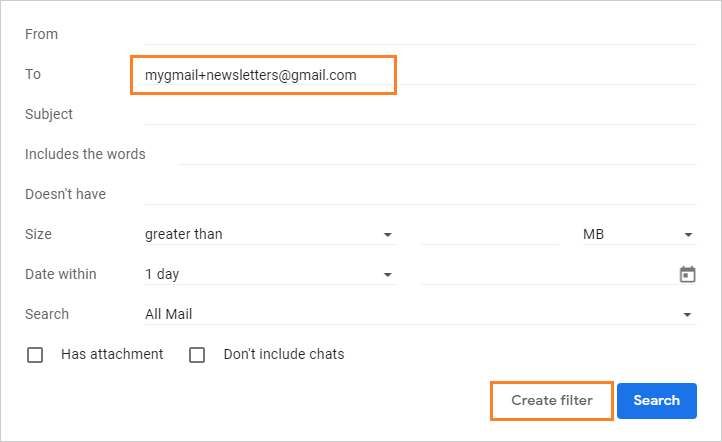
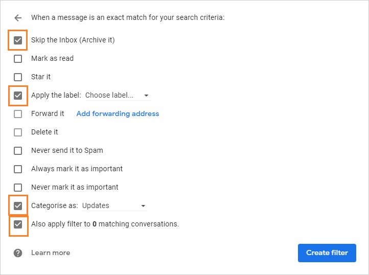

<center>


<span><small>Photo by <a href="https://unsplash.com/@baudy?utm_source=unsplash&amp;utm_medium=referral&amp;utm_content=creditCopyText">Tim Carey</a> on <a href="https://unsplash.com/s/photos/speed?utm_source=unsplash&amp;utm_medium=referral&amp;utm_content=creditCopyText">Unsplash</a></small></span>

</center>


## Shortcuts your commands

If you use bash (and you should use it?) you can customize and add commands that you are using a lot in your daily workflow instated of writing it over and over by simply type the alias for your command.

To activate it very easy, just follow the instruction 

1. Open `.bashrc` file

```bash
# if you are using vs code or open it with any editor you like
code ~/.bashrc
```
2. Add your alias at the end of file
And here are some examples you can use it

```bash
alias lgnpm="npm list -g --depth=0" # list all globally installed package
alias lgu="git config --list --local | grep user.*" # list user name and email associative with current repo
# git commands
alias gf="git fetch origin"
alias gc="git clone"
alias gs="git status"
alias gl="git pull"
alias gp="git push"
alias gc="git commit -d"

# and you know the rest
```

## Filter your mails (works with Gmail only)

When you register for a website for the first time you can change your email address by simply adding plus sign before `@` symbol.

For example, whenever you sign up for a newsletter, you could use mygmail+newsletters@gmail.com. Gmail will not look at what comes after the plus sign in the address so that the emails will come straight your inbox. However, you will still see those messages addressed with the +newsletters part, making them easy to spot & filter.

Using the same newsletters example, you can filter emails you get with mygmail+newsletters. Have them move to a specific folder, be flagged, or marked as read.

<center>
<figure class="image">
  
  <figcaption>Gmail filter step 1</figcaption>
</figure>
<figure class="image">
  
  <figcaption>Gmail filter step 2</figcaption>
</figure>
</center>


